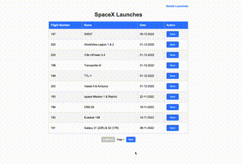

<h2 align="center">Demo</h2>

  

# Getting Started with Server

### `To install dependencies`
npm install

### `To start the server`
npm run dev

Server will start at: `http://localhost:5000`

### `To run test cases`
npm test

# Getting Started with Server

### `To install dependencies`
npm install

### `To start the client`
npm run dev

Client will start at: `http://localhost:3000`

### `To run test cases`
npm test
